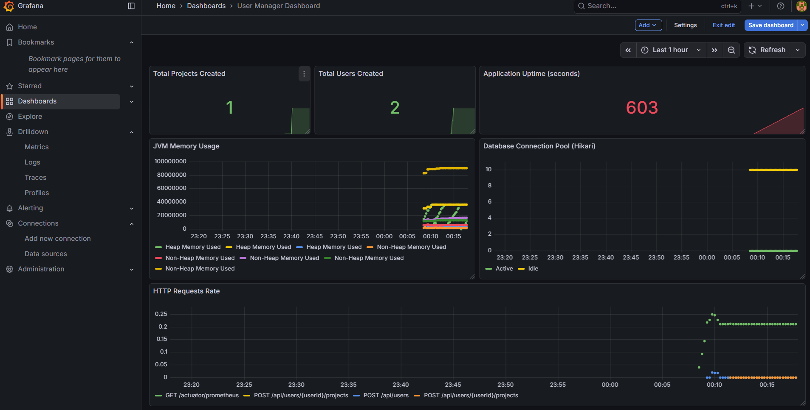
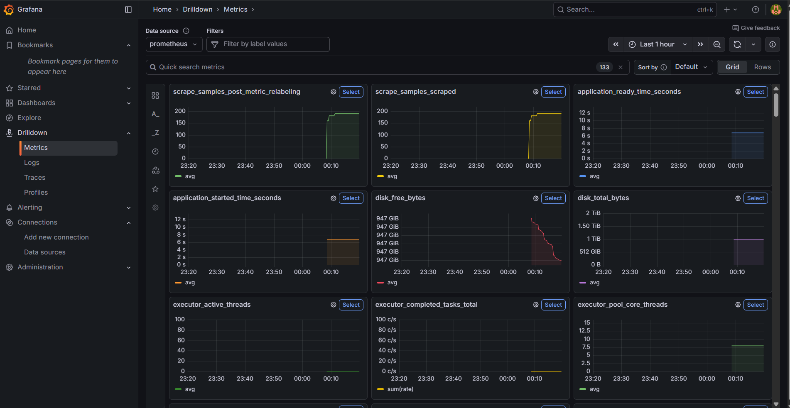
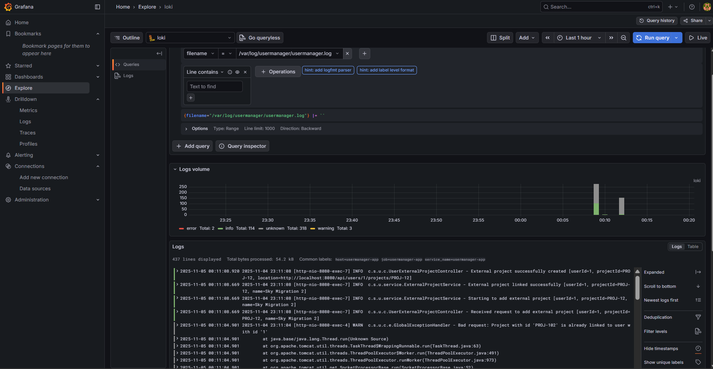
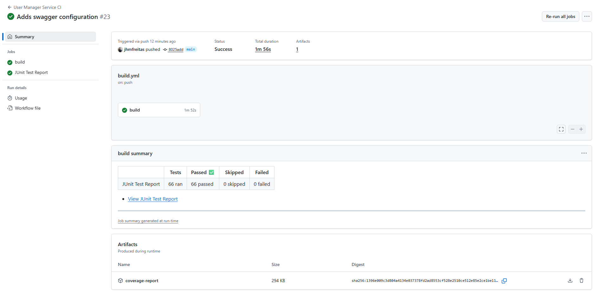
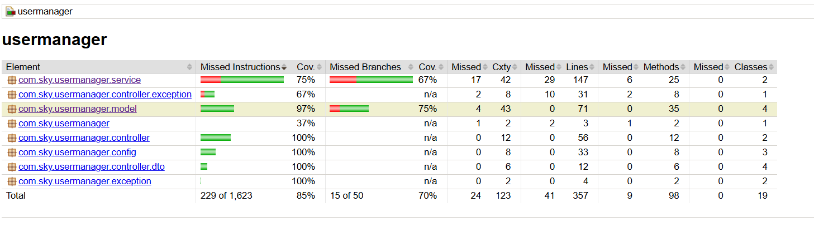

# User Manager Challenge

## Schema Changes Introduced

* Added AUTO_INCREMENT to `tb_user` table
* Added createdAt and updatedAt columns to `tb_user` and `tb_user_external_project` table

## Tech Stack

- Java 17
- Spring Boot 3
- Spring Security (Basic Auth)
- Spring Data JPA + Hibernate
- Micrometer + Prometheus
- MySQL
- Docker & Docker Compose
- JUnit 5 + Mockito
- Grafana
- Prometheus
- Promtail
- Loki (logs)
- Postman
- Swagger UI

## Features Overview

### **Minimal Requirements**

| Requirement                                  | Status | Description                                                                                                |
|----------------------------------------------|:------:|------------------------------------------------------------------------------------------------------------|
| Application should have at least basic auth  |   ✅    | Implemented via Spring Security using in-memory users (`admin` / `user`) + RBAC example with @PreAuthorize |
| Create a new user                            |   ✅    | `POST /api/users`                                                                                          |
| Retrieve user information                    |   ✅    | `GET /api/users/{id}`                                                                                      |
| Delete a user                                |   ✅    | `DELETE /api/users/{id}`                                                                                   |
| Add external project to a user               |   ✅    | `POST /api/users/{userId}/projects`                                                                        |
| Retrieve external projects from a user       |   ✅    | `GET /api/users/{userId}/projects`                                                                         |
| Unit tests for controller and service layers |   ✅    | Implemented using JUnit 5, Mockito, and MockMvc                                                            |
| Containerization                             |   ✅    | Provided with `Dockerfile` and `docker-compose.yml`                                                        |

### **Optional Enhancements**

| Optional Feature                   | Status | Description                                                                                                  |
|------------------------------------|:------:|--------------------------------------------------------------------------------------------------------------|
| Update user information            |   ✅    | `PUT /api/users/{id}`                                                                                        |
| Configure logs                     |   ✅    | Configured using SLF4J and Logback with log persistence to `/var/log/usermanager` + Grafana Loki integration |
| Configure metrics                  |   ✅    | Micrometer + Actuator + Prometheus integration + Grafana integration                                         |
| Docker Compose setup with MySQL DB |   ✅    | Provided in `docker-compose.yml`                                                                             |

## Authentication

The service uses **HTTP Basic Authentication** for simplicity.  
In-memory users are defined in [`SecurityConfig`](src/main/java/com/sky/usermanager/config/SecurityConfig.java):

| Username | Password   | Role    |
|----------|------------|---------|
| `admin`  | `admin123` | `ADMIN` |
| `user`   | `user123`  | `USER`  |

## Running the Application

1. Build the application: `mvn clean package`
2. Build the Docker image: `docker build --no-cache -t app-user:latest .`
3. Run the application: `docker compose up -d`
4. To stop the application: `docker compose down`

## Postman Collection

A Postman collection with a request for each of the requirements is provided in the [`postman`](postman) folder.

## Grafana + Loki + Prometheus Integration

The dashboard and datasource configuration for the integration with these monitoring tools is under [
`monitoring`](monitoring) folder. Inside this folder, there is already a minimalistic grafana dashboard that can be used
to monitor the application. Moreover, it is possible to use the Explore and Drilldown features of Grafana to explore
the logs and metrics.

Grafana UI will be available at `http://localhost:3000` and can be accessed with the default credentials: `admin` /
`admin`.

### Grafana Screenshots

**Grafana Dashboard**

**Drilldown Metrics feature**

**Explore Logs feature**

## Services Available

- **User Manager App** - `http://localhost:8080`
- **Prometheus** - `http://localhost:9090`
- **Grafana** - `http://localhost:3000`
- **Swagger UI** - `http://localhost:8080/swagger-ui.html`

## CI Pipeline

Added Github Action CI pipeline to build the application, run tests, performs minimalistic static analysis and produces
Jacoco coverage report.

**CI Pipeline**

**Jacoco Coverage Report**

## Demo

A short demo validating the APIs via Postman and showcasing the Grafana integration, was included in the [`docs`](docs) folder

## Possible Future Improvements

- [ ] Add tracing with **SLF4J MDC** + integration with Grafana Tempo
- [ ] Implement **pagination** for user and project retrieval
- [ ] Configure **alerting** in Prometheus / Grafana
- [ ] Integrate with **SonarCloud** for code quality and coverage